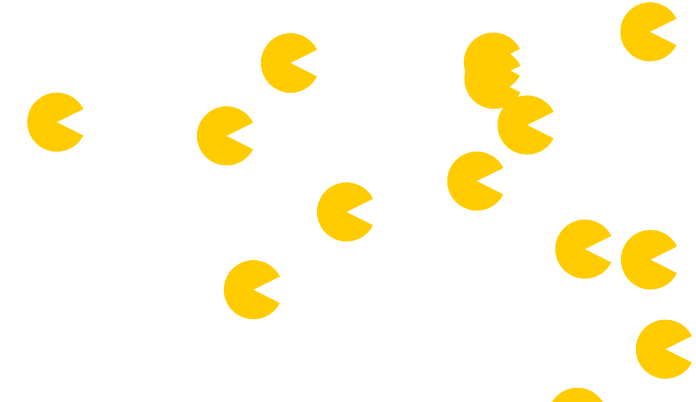

Pacman Assignment

Description: The create a Pacman assigment is designed to create an new pacman, once everytime "Add PacMan" is clicked.
When the PacMen are on screen they should move across the screen randomly and bounce off edges. 

How to run: First install all associated files of the Repository on GitHub and place them into a individual folder.
Once done open a web browser and search "about:blank". The last step is to click and drag the "index.html" file onto the blank 
browser. Congrats! You can play Create a PacMan!

Future Improvements: I plan to make ghost that will collide with the pacmen, serving as pacmen v. ghost fight.

License Information:

MIT License

Copyright (c) 2023 JaegerNolte

Permission is hereby granted, free of charge, to any person obtaining a copy
of this software and associated documentation files (the "Software"), to deal
in the Software without restriction, including without limitation the rights
to use, copy, modify, merge, publish, distribute, sublicense, and/or sell
copies of the Software, and to permit persons to whom the Software is
furnished to do so, subject to the following conditions:

The above copyright notice and this permission notice shall be included in all
copies or substantial portions of the Software.

THE SOFTWARE IS PROVIDED "AS IS", WITHOUT WARRANTY OF ANY KIND, EXPRESS OR
IMPLIED, INCLUDING BUT NOT LIMITED TO THE WARRANTIES OF MERCHANTABILITY,
FITNESS FOR A PARTICULAR PURPOSE AND NONINFRINGEMENT. IN NO EVENT SHALL THE
AUTHORS OR COPYRIGHT HOLDERS BE LIABLE FOR ANY CLAIM, DAMAGES OR OTHER
LIABILITY, WHETHER IN AN ACTION OF CONTRACT, TORT OR OTHERWISE, ARISING FROM,
OUT OF OR IN CONNECTION WITH THE SOFTWARE OR THE USE OR OTHER DEALINGS IN THE
SOFTWARE.